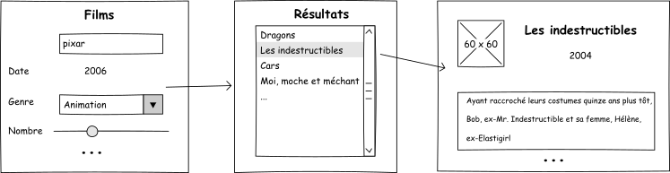

# Projet SAÉ 4 - R4.11 Dév. mobile

Vous devrez développer une application Android native Android (*déployable sur une machine de l'iut*) par sous-équipe de projet SAÉ (2-3 étudiants ; normalement 2 sous-équipes par équipe de SAÉ).
Cette application devra :

- récupérer des données sur `https://www.themoviedb.org/` ;
- proposer (à minima) 3 activités différentes (une page de recherche/paramétrage, une page d'affichage dans une `ListView`, une page "vue détaillée", ...) ;
- utiliser des `ListView` *personnalisées* ;
- comporter des classes de données (`Film`, ...) correspondant à la partie modèle de votre application ;
- afficher des images téléchargées dynamiquement.

De plus, votre application pourra démontrer l'usage d'*aspects* du développement android non-abordés dans les tutoriels. Quelques exemples : 

- tri des résultats ;
- basculement portait/paysage ;
- gestion des locales (EN, FR) ; 
- utilisation de `Fragments` ;
- géolocalisation + cartes ;
- persistance des données ;
- etc.

Votre application utilisera l'api `https://developer.themoviedb.org/reference/intro/getting-started` (documentation `https://developer.themoviedb.org/docs/getting-started`). Pour utiliser cette API, il vous faut obtenir une clé au préalable.
Voici une proposition de maquette mais vous pouvez en concevoir une autre.

Les bibliothèques autorisées, sont celles utilisées en TD ou citées en cours (`ktor`, `volley`, `kotlinx-serialization`, `kotlin-parcelize`, `picasso`, `coil`).

## Rendu - Recette finale

L'évaluation, qui se fera sous la forme d'une revue de code avec une présentation du projet, aura lieu le 18 avril.

Quelques précisions :
- votre code sera récupéré via *votre* dépôt Git *uniquement* ;
- vous créerez dans votre git un répertoire `Android` contenant un `Readme.md` spécifique Dév. mobile ainsi que votre application ;
- votre code sera re-compilé, puis déployé sur la machine de l'enseignant en charge de votre recette ;
- assurez-vous également que votre code puisse également être compilé/déployé sur une machine de l'IUT.
